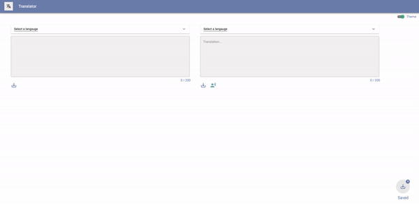
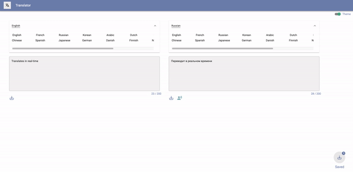
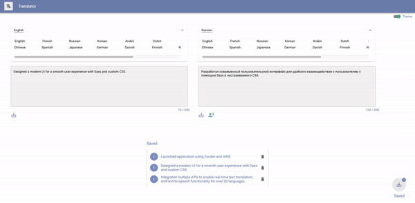

# Translate - Text-to-Speech Translation Application

MVP project completed in 1 day.

I used Google's API and a text-to-speech API to transform input text into a user
selected language.

## Tech Stack

- [React](https://nodejs.org/en/)
- [Node](https://nodejs.org/en/)
- [Express](https://expressjs.com/)
- [AWS](https://aws.amazon.com/)
- [MongoDB](https://www.mongodb.com/)
- [Docker](https://www.docker.com/)
